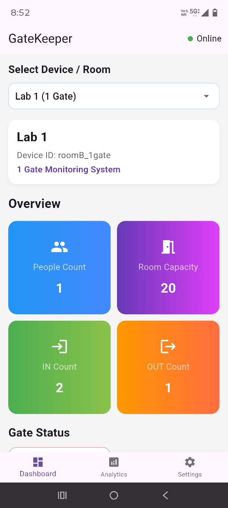
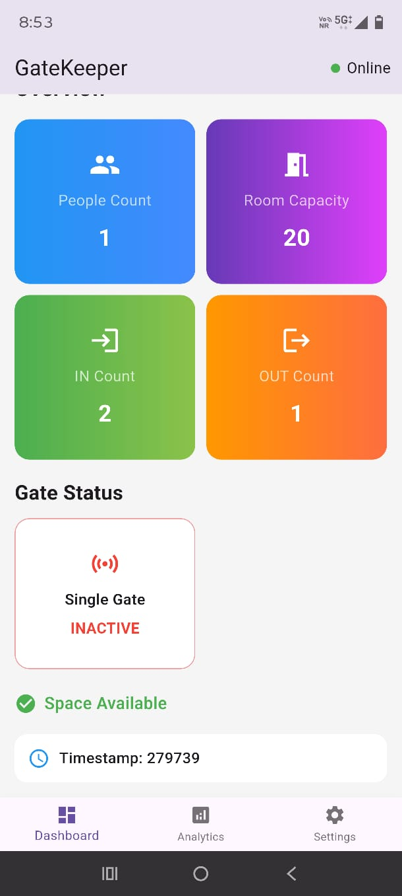
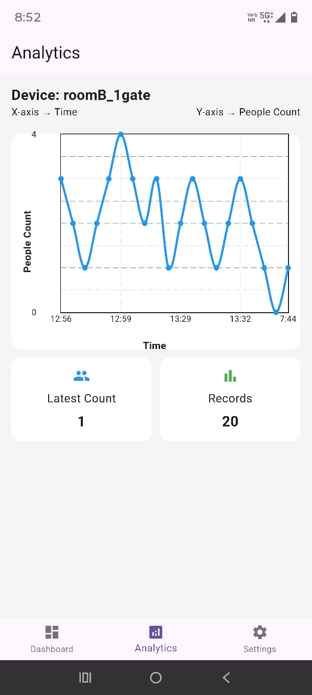
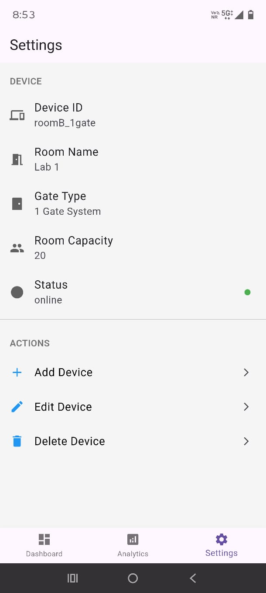
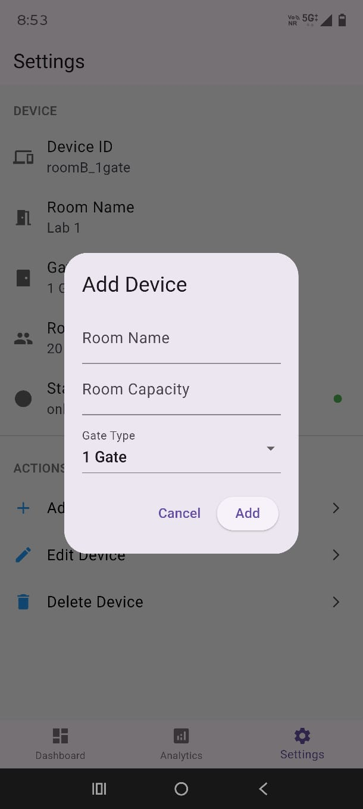
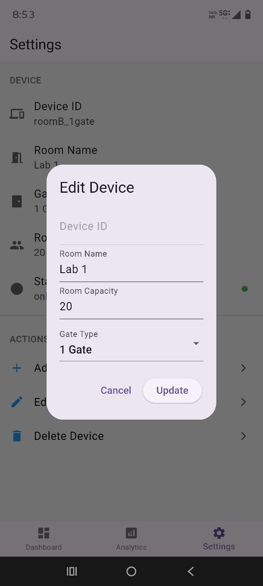
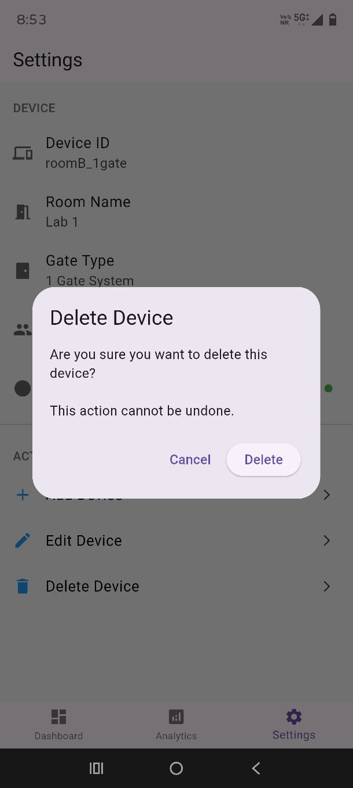

# GateKeeper: Room Occupancy Monitoring System

##  Overview

GateKeeper is an IoT-based Room Occupancy Monitoring System designed to automatically track the number of people entering and exiting a room in real time. The system eliminates the need for manual counting by using sensors, cloud integration, and a mobile application for monitoring and analysis.

It provides a cost-effective, scalable, and efficient solution for environments such as classrooms, offices, libraries, and restricted areas.

---

## Features

* Real-time occupancy tracking
* Automatic entry and exit detection using IR sensors
* Support for both **single-gate and dual-gate systems**
* Live data synchronization using cloud services
* Mobile application for remote monitoring
* Data logging and historical analysis using Google Sheets
* Graph-based visualization of occupancy trends
* Device management (add/edit/delete devices)

---

## System Architecture

The system is divided into three layers:

### 1. Hardware Layer

* IR Sensors detect movement
* ESP32 processes sensor data
* LCD displays real-time occupancy

### 2. Cloud Layer

* Firebase Realtime Database for live data
* Google Apps Script + Google Sheets for storage

### 3. Application Layer

* Flutter mobile app for monitoring and analytics

---

##  Working Flow

1. IR sensors detect movement at entry/exit points
2. ESP32 processes the sequence to identify entry or exit
3. Occupancy count is updated in real time
4. Data is:

   * Displayed on LCD
   * Sent to Firebase
   * Logged into Google Sheets via Apps Script
5. Flutter app fetches:

   * Real-time data from Firebase
   * Historical data from Google Sheets
6. UI updates instantly with count and graphs

---
## Screenshots

###  Home Screen



### Analytics Screen


###  Settings Screen





---


##  Tech Stack

* **Hardware:** ESP32, IR Sensors, 20x4 LCD
* **Languages:** C/C++, Dart, JavaScript
* **Frameworks:** Flutter
* **Cloud:** Firebase Realtime Database
* **Backend Integration:** Google Apps Script
* **Storage:** Google Sheets

---

##  Setup Instructions

### Arduino (ESP32)

* Upload `.ino` code to ESP32 using Arduino IDE
* Connect IR sensors and LCD
* Configure Wi-Fi and API endpoints

---

### Google Apps Script

1. Open Apps Script editor
2. Add your `Code.gs`
3. Deploy as **Web App**:

   * Execute as: Me
   * Access: Anyone
4. Use generated URL in ESP32 / Flutter

---

###  Flutter App

```bash
flutter pub get
flutter run
```

---

##  Database Design

### Firebase (Real-Time Data)

* Stores device info and live occupancy
* Updates instantly across system

### Google Sheets (Historical Data)

* Stores logs with timestamp
* Used for analytics and graph generation

---

##  Testing

The system was tested at multiple levels:

* Unit Testing (sensor logic, counting logic)
* Integration Testing (ESP32 + Firebase + App)
* System Testing (complete flow)
* Hardware Testing (sensor accuracy, connectivity)

All modules performed successfully under real-time conditions.

---

##  Results

* Accurate real-time occupancy tracking
* Reliable cloud synchronization
* Successful integration of hardware and software
* Functional mobile app with live updates and graphs

---

##  Limitations

* Accuracy affected by environmental conditions
* Requires stable internet connection
* No advanced identification (only counting, not tracking individuals)

---

## Future Improvements

* AI-based vision sensors for higher accuracy
* Multi-room monitoring system
* Predictive analytics using ML
* Web dashboard for admin control
* Integration with smart systems 

---

## Learning Outcomes

* IoT system integration (hardware + software)
* ESP32 programming and sensor handling
* Firebase real-time data handling
* Google Apps Script API development
* Flutter app development with real-time UI

---

##  Contributor

* Ishika Jain

---

##  Final Note

This project demonstrates a complete **end-to-end IoT system**, integrating embedded systems, cloud computing, and mobile application development into a single real-world solution.
